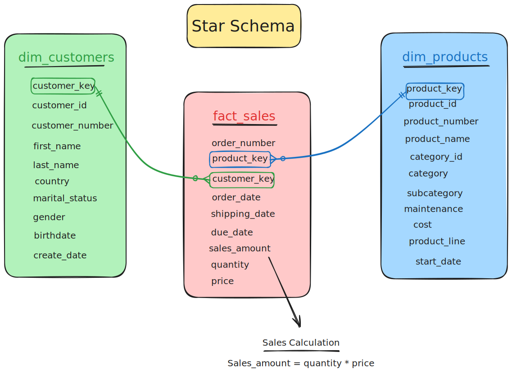

# SQL Data Engineering Project

This project demonstrates a complete data engineering workflow, from raw data ingestion to building a sophisticated data warehouse. It includes data extraction, transformation, and loading (ETL) processes, data quality checks, and the creation of both Star and Snowflake schemas for analytical purposes.


## Project Structure

The project is organized into the following directories:

- **`DATE_WAREHOUSE/`**: Contains all the core data warehousing components.
    - **`datasets/`**: Holds the raw source data in CSV format.
        - `source_crm/`: Customer, product, and sales data.
        - `source_erp/`: Customer, location, and category data.
    - **`docs/`**: Contains project documentation.
        - `data_catalog.md`: A detailed catalog of the Gold Layer tables.
        - Various diagrams illustrating the data architecture, flow, and models.
    - **`scripts/`**: Contains all the SQL scripts for the ETL process.
        - `init_database.sql`: Initializes the databases (bronze, silver, star, snowflake).
        - `bronze/`: Scripts to load raw data into the Bronze Layer.
        - `silver/`: Scripts to clean and transform data into the Silver Layer.
        - `gold/`: Scripts to load data into the Gold Layer, with subdirectories for:
            - `star/`: Star Schema model.
            - `snowflake/`: Snowflake Schema model.
    - **`tests/`**: Contains SQL scripts for data quality checks.
        - `quality_checks_silver.sql`: Checks for the Silver Layer.
        - `quality_checks_gold.sql`: Checks for the Gold Layer.
- **`ADVANCED_DATA_ANALYTICS.ipynb`**: Jupyter Notebook for advanced data analysis on the Gold Layer.
- **`EXPLORATORY_DATA_ANALYSIS.ipynb`**: Jupyter Notebook for exploratory data analysis (EDA) on the Silver Layer.

## Data Warehouse Architecture

The data warehouse follows a multi-layered architecture:

1.  **Bronze Layer**: Raw, unfiltered data is ingested from the source CSV files into the `bronze` database. This layer serves as a staging area.
2.  **Silver Layer**: Data from the Bronze Layer is cleaned, transformed, and standardized. This layer provides a more refined and queryable version of the data, stored in the `silver` database.
3.  **Gold Layer**: The final, business-ready layer, designed for analytics and reporting. This project implements two different data models in the Gold Layer:
    -   **Star Schema**: A traditional data warehouse schema with a central fact table (`fact_sales`) and denormalized dimension tables (`dim_customers`, `dim_products`). Stored in the `star` database.
    -   **Snowflake Schema**: A more normalized version of the star schema, where dimension tables are broken down into further, more normalized tables. Stored in the `snowflake` database.

## How to Run the Project

1.  **Initialize the Databases**:
    Run the `init_database.sql` script to create the `bronze`, `silver`, `star`, and `snowflake` databases.

    ```sql
    -- Run this in your MySQL client
    SOURCE DATE_WAREHOUSE/scripts/init_database.sql;
    ```

2.  **Load the Bronze Layer**:
    Execute the `load_bronze.sql` script to ingest the raw data from the CSV files into the `bronze` database.

    ```sql
    -- Run this in your MySQL client
    SOURCE DATE_WAREHOUSE/scripts/bronze/load_bronze.sql;
    ```

3.  **Load the Silver Layer**:
    Run the `proc_load_silver.sql` script to create and then call the stored procedure that cleans and transforms the data from the Bronze Layer to the Silver Layer.

    ```sql
    -- Run this in your MySQL client
    SOURCE DATE_WAREHOUSE/scripts/silver/proc_load_silver.sql;
    CALL silver.load_silver();
    ```

4.  **Run Silver Layer Quality Checks**:
    Execute the `quality_checks_silver.sql` script to verify the data quality in the Silver Layer.

    ```sql
    -- Run this in your MySQL client
    SOURCE DATE_WAREHOUSE/tests/quality_checks_silver.sql;
    ```

5.  **Load the Gold Layer**:
    Choose which schema you want to load (or load both).

    -   **Star Schema**:
        ```sql
        -- Run this in your MySQL client
        SOURCE DATE_WAREHOUSE/scripts/gold/star/proc_load_star.sql;
        CALL star.pro_load_star();
        ```

    -   **Snowflake Schema**:
        ```sql
        -- Run this in your MySQL client
        SOURCE DATE_WAREHOUSE/scripts/gold/snowflake/proc_load_snowflake.sql;
        CALL snowflake.pro_load_snowflake();
        ```

6.  **Run Gold Layer Quality Checks**:
    Execute the `quality_checks_gold.sql` script to verify the data integrity of the Gold Layer.

    ```sql
    -- Run this in your MySQL client
    SOURCE DATE_WAREHOUSE/tests/quality_checks_gold.sql;
    ```

7.  **Perform Data Analysis**:
    -   Use the `EXPLORATORY_DATA_ANALYSIS.ipynb` notebook to explore the cleaned data in the Silver Layer.
    -   Use the `ADVANCED_DATA_ANALYTICS.ipynb` notebook to perform more in-depth analysis on the structured data in the Gold Layer.

## Data Models

### Star Schema



-   **Fact Table**: `fact_sales`
-   **Dimension Tables**: `dim_customers`, `dim_products`

This model is optimized for fast querying and simple aggregations.

### Snowflake Schema


-   **Fact Table**: `fact_sales`
-   **Dimension Tables**: `dim_customers`, `dim_products`, `dim_country`, `dim_category`, `dim_subcategory`, `dim_product_line`

This model is more normalized, reducing data redundancy but requiring more complex joins for queries.

## Tools and Technologies

-   **Database**: MySQL
-   **Language**: SQL, Python
-   **Tools**: Jupyter Notebook, Git
-   **Libraries**: pandas, matplotlib, seaborn
